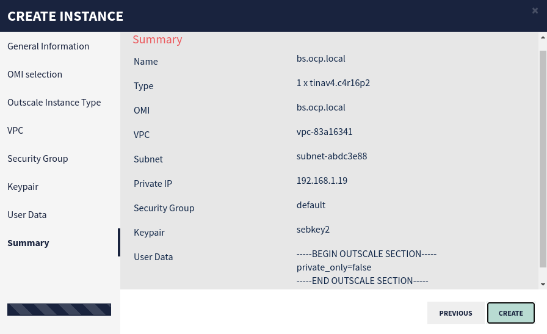

# Installing Openshift 4.8 on Outscale


:warning: Since for security reasons both booting on ISO and PXE is not allowed on Outscale following [Redhat instructions](https://docs.openshift.com/container-platform/4.8/installing/installing_platform_agnostic/installing-platform-agnostic.html#creating-machines-bare-metal_installing-platform-agnostic) are not suitable. So the trick will be to create and boot on pre-configured images.

## Setup VPC

### Browse and log on COCKPIT

```
https://cockpit-eu-west-2.outscale.com/
```

### Create a VPC

Follow [Outscale instructions](https://docs.outscale.com/en/userguide/Creating-a-VPC.html).


### Create a Subnet in the VPC

Follow [Outscale instructions](https://docs.outscale.com/en/userguide/Creating-a-Subnet-in-a-VPC.html).


### Create a Internet Gateways and attach it to the VPC

Follow [Outscale instructions](https://docs.outscale.com/en/userguide/Creating-an-Internet-Gateway.html) to create.

Follow [Outscale instructions](https://docs.outscale.com/en/userguide/Attaching-an-Internet-Gateway-to-a-VPC.html) to attach.


### Allocate EIPs (External IP Address) to your account

:bulb: **8 EIPs** will be needed (**1** for **bootstrap**, **3** for **masters**, **2** for **workers**, **1** for **load balancer** and **1** for **GUI gateway**)

Follow [Outscale instructions](https://docs.outscale.com/en/userguide/Allocating-an-EIP-to-Your-Account.html).


### Create a Route Table

Follow [Outscale instructions](https://docs.outscale.com/en/userguide/Creating-a-Route-Table.html).


### Create a Security Group

Follow [Outscale instructions](https://docs.outscale.com/en/userguide/Creating-a-Security-Group.html).


### Adding Rules to the Security Group

Follow [Outscale instructions](https://docs.outscale.com/en/userguide/Adding-Rules-to-a-Security-Group.html).


### Create a Keypair

Follow [Outscale instructions](https://docs.outscale.com/en/userguide/Creating-a-Keypair.html).

:warning: Save the private key carefully, as you will need to use its content to connect to your resources. Outscale cannot provide it in case of loss.

:bulb: The user associate to the key is **outscale**.


## Setup Load Balancer

:information_source: Load balancer will be used as **PROXY**, **DNS** and image builder using **coreos-installer** cmd tool.


### Create Load Balancer Instance

Follow [Outscale instructions](https://docs.outscale.com/en/userguide/Expert-Mode-Launching-Instances-Using-Cockpit.html)


### Associating an EIP to Load Balancer Instance

Follow [Outscale instructions](https://docs.outscale.com/en/userguide/Associating-an-EIP-with-an-Instance-or-a-Network-Interface.html)


### Log to the Load Balancer

:information_source: Run this on your device.

```
PRIVATE_KEY_FILE="key.rsa"
USER="outscale"
EIP="xxx.xxx.xxx.xxx"

ssh -o StrictHostKeyChecking=no -i ${PRIVATE_KEY_FILE} -l ${USER} ${EIP}
```


### Configure Load Balancer

#### Install useful tools

:information_source: Run this on the load balancer.

```
sudo yum install epel-release -y

sudo yum install coreos-installer jq screen wget -y
```


#### Install DNS

:information_source: Run this on the load balancer.

Following entries has to be added where **ocp is the cluster name** and **local is the domain**:

| hostname          | ip address     |
| ----------------- | -------------- |
| lb.ocp.local      | 192.168.1.10   |
| m1.ocp.local      | 192.168.1.11   |
| m2.ocp.local      | 192.168.1.12   |
| m3.ocp.local      | 192.168.1.13   |
| w1.ocp.local      | 192.168.1.14   |
| w2.ocp.local      | 192.168.1.15   |
| bs.ocp.local      | 192.168.1.19   |
| api-int.ocp.local | 192.168.1.10   |
| api.ocp.local     | 192.168.1.10   |
| apps.ocp.local    | 192.168.1.10   |
| *.apps.ocp.local  | apps.ocp.local |

:bulb: Follow those [guidelines](https://github.com/bpshparis/sandbox/blob/master/DNS.md#dns) to install DNS, add records above and check everything is set accordingly.

:bulb: Follow Redhat [guidelines](https://docs.openshift.com/container-platform/4.8/installing/installing_platform_agnostic/installing-platform-agnostic.html#installation-user-provisioned-validating-dns_installing-platform-agnostic).

#### Install HAProxy

:information_source: Run this on the load balancer.

##### Set environment

```
OCP="ocp"
DOMAIN=$(cat /etc/resolv.conf | awk '$1 ~ "^search" {print $2}') && echo $DOMAIN
LB_CONF="/etc/haproxy/haproxy.cfg" && echo $LB_CONF
[ -f "$LB_CONF" ] && echo "haproxy already installed" || sudo yum install haproxy -y
```

##### :bulb: **Optional**: Remove existing config

```
sudo sed -i '/^\s\{1,\}maxconn\s\{1,\}3000$/q' $LB_CONF
```

##### Configure HAProxy

```
sudo tee -a $LB_CONF << EOF

listen stats
    bind :9000
    mode http
    stats enable
    stats uri /

frontend ingress-http
    bind *:80
    default_backend ingress-http
    mode tcp
    option tcplog

backend ingress-http
    balance source
    mode tcp
    server w1.$OCP $(dig +short w1.$OCP.$DOMAIN):80 check
    server w2.$OCP $(dig +short w2.$OCP.$DOMAIN):80 check
    server w3.$OCP $(dig +short w3.$OCP.$DOMAIN):80 check

frontend ingress-https
    bind *:443
    default_backend ingress-https
    mode tcp
    option tcplog

backend ingress-https
    balance source
    mode tcp
    server w1.$OCP $(dig +short w1.$OCP.$DOMAIN):443 check
    server w2.$OCP $(dig +short w2.$OCP.$DOMAIN):443 check
    server w3.$OCP $(dig +short w3.$OCP.$DOMAIN):443 check

frontend openshift-api-server
    bind *:6443
    default_backend openshift-api-server
    mode tcp
    option tcplog

backend openshift-api-server
    balance source
    mode tcp
    server m1.$OCP $(dig +short m1.$OCP.$DOMAIN):6443 check
    server m2.$OCP $(dig +short m2.$OCP.$DOMAIN):6443 check
    server m3.$OCP $(dig +short m3.$OCP.$DOMAIN):6443 check
    server bs.$OCP $(dig +short bs.$OCP.$DOMAIN):6443 check

frontend machine-config-server
    bind *:22623
    default_backend machine-config-server
    mode tcp
    option tcplog

backend machine-config-server
    balance source
    mode tcp
    server m1.$OCP $(dig +short m1.$OCP.$DOMAIN):22623 check
    server m2.$OCP $(dig +short m2.$OCP.$DOMAIN):22623 check
    server m3.$OCP $(dig +short m3.$OCP.$DOMAIN):22623 check
    server bs.$OCP $(dig +short bs.$OCP.$DOMAIN):22623 check

EOF
```

##### Start  HAProxy

```
sudo systemctl restart haproxy && sleep 5 &&
RC=$(curl -I http://lb.$OCP:9000 | awk 'NR==1 {print $3}') && echo $RC &&
sudo systemctl enable haproxy
```

#### Generating a key pair for cluster node SSH access

:information_source: Run this on the load balancer.

Follow Redhat [guidelines](https://docs.openshift.com/container-platform/4.8/installing/installing_platform_agnostic/installing-platform-agnostic.html#ssh-agent-using_installing-platform-agnostic).


#### Obtain Openshift installation program

:information_source: Run this on the load balancer.

Follow Redhat [guidelines](https://docs.openshift.com/container-platform/4.8/installing/installing_platform_agnostic/installing-platform-agnostic.html#installation-obtaining-installer_installing-platform-agnostic).


#### Install the OpenShift CLI by downloading the binary

:information_source: Run this on the load balancer.

Follow Redhat [guidelines](https://docs.openshift.com/container-platform/4.8/installing/installing_platform_agnostic/installing-platform-agnostic.html#cli-installing-cli_installing-platform-agnostic).


#### Manually create the installation configuration file

:information_source: Run this on the load balancer.

Follow Redhat [guidelines](https://docs.openshift.com/container-platform/4.8/installing/installing_platform_agnostic/installing-platform-agnostic.html#installation-initializing-manual_installing-platform-agnostic).

:bulb: You should list **3** ign files (**bootstrap.ign, master.ign and worker.ign**) in your working directory.


#### Download Red Hat Enterprise Linux CoreOS raw image

:information_source: Run this on the load balancer.

```
wget -c https://mirror.openshift.com/pub/openshift-v4/x86_64/dependencies/rhcos/4.8/latest/rhcos-4.8.14-x86_64-metal.x86_64.raw.gz
```

## Create Red Hat Enterprise Linux CoreOS Outscale Machine Images (OMI)

:information_source: The target is to build **6 RHCOS OMI** (1 bootstrap, 3 masters and 2 workers) ready to boot with **an embedded ignition file** and **network settings set in kernel arguments**.


### Create a Volume

:information_source: Run this on Outscale COCKPIT console.

Follow [Outscale instructions](https://docs.outscale.com/en/userguide/Creating-a-Volume.html)


### Attach Volume to the Load Balancer Instance

:information_source: Run this on Outscale COCKPIT console.

Follow [Outscale instructions](https://docs.outscale.com/en/userguide/Attaching-a-Volume-to-an-Instance.html)


## 

### Install RHCOS on Volume

:information_source: Run this on the load balancer.

#### Check Volume is available

```
lsblk
```

:bulb: A **non formatted volume** should be available (e.g. **sda**).


#### Set common environment variables

```
VOLUME="sda"
IMG="rhcos-4.8.14-x86_64-metal.x86_64.raw.gz"
IF="ens3"
```


#### Set specific environment variables

```
HOSTNAME="bs"
IGN="bootstrap.ign"
IP="192.168.1.19"
```


#### Run coreos-installer command

```
sudo coreos-installer install \
--insecure -f ${IMG} \
--insecure-ignition -i ${IGN} \
--append-karg "rd.neednet=1 ip=${IP}::192.168.1.1:255.255.255.0:${HOSTNAME}.ocp.local:${IF}:none nameserver=192.168.1.10" \
/dev/${VOLUME}
```


#### Check Volume structure

```
lsblk
```


#### Check ignition file and kernel arguments in boot partition

##### Set environment variables

```
SOURCE="/dev/sda3"
TARGET="/mnt/sda3"
IGN=${TARGET}"/ignition/config.ign"
KARGS=${TARGET}"/loader/entries/ostree-1-rhcos.conf"
```

 ##### Mount boot partition

```
[ -d "${TARGET}" ] && echo ${TARGET}" already exits" || { echo "creating" ${TARGET}; sudo mkdir ${TARGET}; echo RC=$?; }
sudo mount ${SOURCE} ${TARGET} && echo "Mounting ${SOURCE} on ${TARGET} RC="$?
```

##### Check ignition file

```
[ -f "${IGN}" ] && jq . ${IGN} || echo "ERROR:" ${IGN} "not found !!!"
```

##### Check kernel arguments

```
[ $(grep -c "${IP}O" "${KARGS}") -eq 1 ] && echo "OK" || echo "KO"
```

##### Unmount Volume

```
sudo umount ${TARGET} && echo "RC="$?
```


### Create RHCOS Snapshot

:information_source: Run this on Outscale COCKPIT console.

#### Detach Volume from Load Balancer Instance

Follow [Outscale instructions](https://docs.outscale.com/en/userguide/Detaching-a-Volume-from-an-Instance.html)


#### Create a Snapshot of the Volume

Follow [Outscale instructions](https://docs.outscale.com/en/userguide/Creating-a-Snapshot-of-a-Volume.html)


#### Create an OMI from a Snapshot

Follow [Outscale instructions](https://docs.outscale.com/en/userguide/Creating-an-OMI-from-a-Snapshot.html)


## Complete steps above From Attach Volume to Load Balancer Instance step for masters and workers nodes

:warning: :warning: :warning: Don't forget to update environment variable :warning: :warning: :warning: 

#### Set master1 environment variables

```
HOSTNAME="m1"
IGN="master.ign"
IP="192.168.1.11"
```

#### Set master2 environment variables

```
HOSTNAME="m2"
IGN="master.ign"
IP="192.168.1.12"
```

#### Set master1 environment variables

```
HOSTNAME="m3"
IGN="master.ign"
IP="192.168.1.13"
```

#### Set worker1 environment variables

```
HOSTNAME="w1"
IGN="worker.ign"
IP="192.168.1.14"
```

#### Set worker2 environment variables

```
HOSTNAME="w2"
IGN="worker.ign"
IP="192.168.1.15"
```

:bulb:Below is what is expected on Outscale COCKPIT console to go any further.


## Create Openshift Cluster nodes based on Outscale OMI

:information_source: Run this on Outscale COCKPIT console.

### Create and Launch Instance

Follow [Outscale instructions](https://docs.outscale.com/en/userguide/Expert-Mode-Launching-Instances-Using-Cockpit.html)

:bulb: bootstrap and masters have to be set with at least **4 VCPU** and **16 GB RAM** (e.g. 1 x tinav4.**c4r16**p2)

:bulb: workers have to be set with at least **2 VCPU** and **8 GB RAM** (e.g. 1 x tinav4.**c2r8**p2)



### Associate an External IP address (EIP) to the Instance

Follow [Outscale instructions](https://docs.outscale.com/en/userguide/Associating-an-EIP-with-an-Instance-or-a-Network-Interface.html)

:information_source: The instance should has already been started


:checkered_flag::checkered_flag::checkered_flag:


## Wait for Cluster Installation process to complete

:information_source: Run this on the load balancer.

Follow Redhat [guidelines](https://docs.openshift.com/container-platform/4.8/installing/installing_platform_agnostic/installing-platform-agnostic.html#installation-installing-bare-metal_installing-platform-agnostic).


